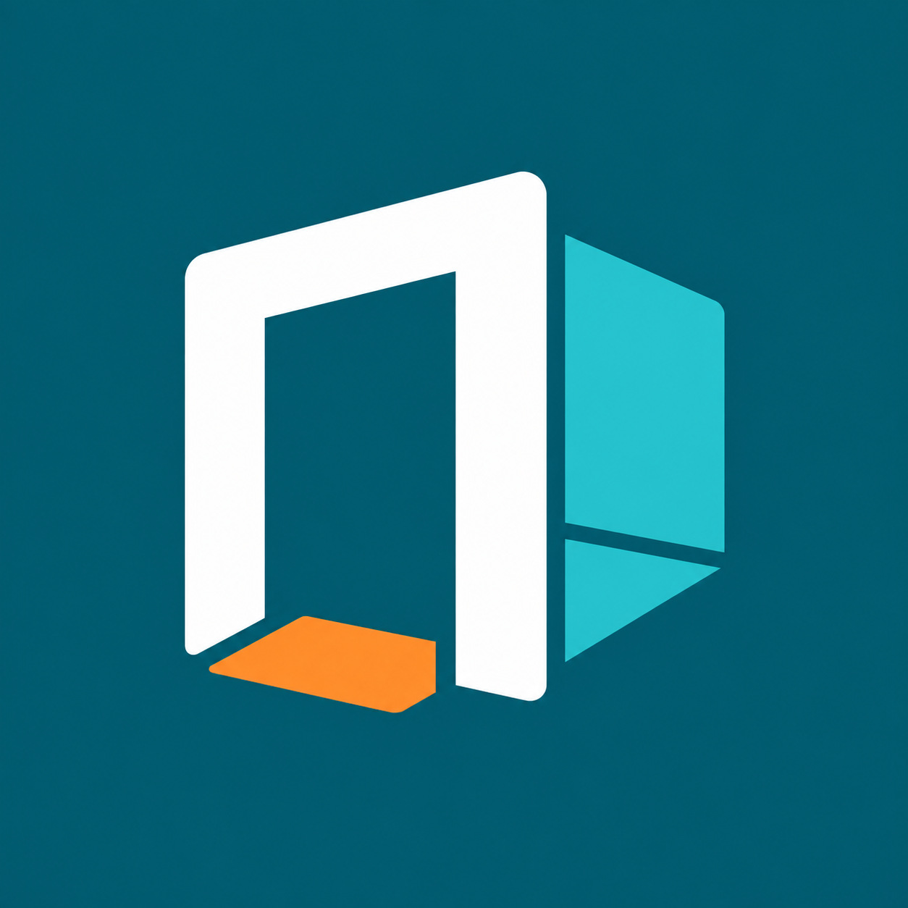

# Elsebase platform logo

[Download the square PNG](elsebase-icon.png)

File: 1254 x 1254 pixels, RGB PNG, 927149 bytes.

The shared symbol-only icon is intended for the CurseForge project and GitHub avatar. It refines the selected **The doorway beyond** study: white doorway, turquoise room corner and orange threshold on an opaque deep teal background. The generous margin accommodates rounded and circular display crops. The name is omitted for small-size readability.

This is a raster PNG, not an editable vector master. The generated output was visually checked for its silhouette, spacing and fidelity to the selected direction. It retains slight tonal variation. No platform upload or mod-JAR icon replacement is included.

Created with the built-in ImageGen tool. See [generation provenance and exact prompt](generation.json) and the [original studies](../elsebase-logo-proposals.md).
