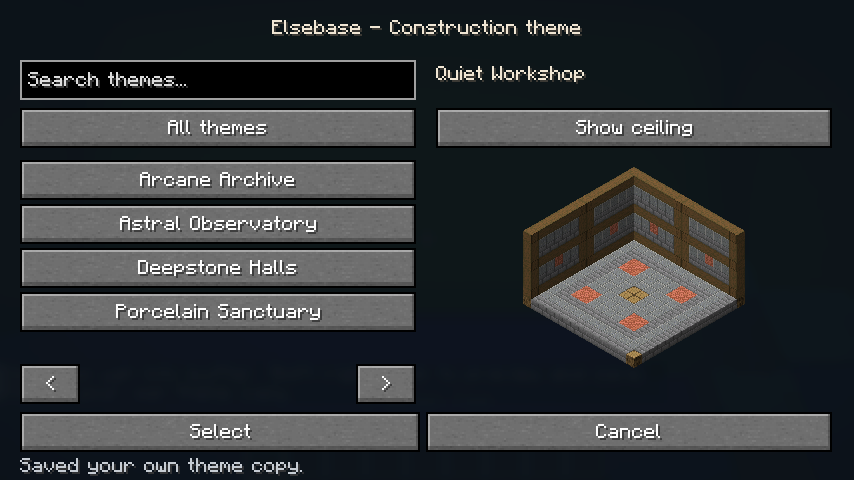
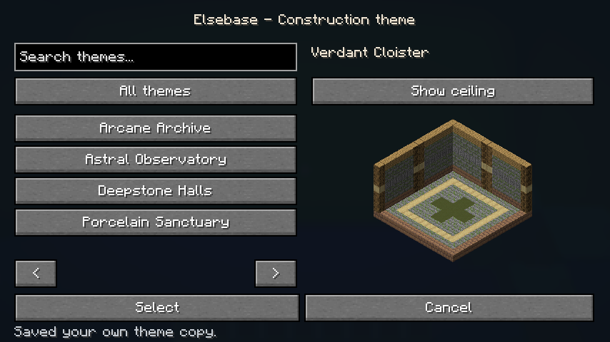
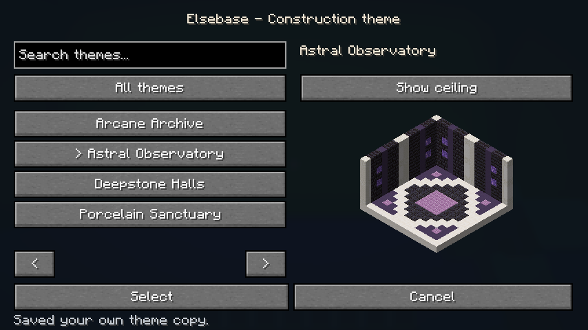
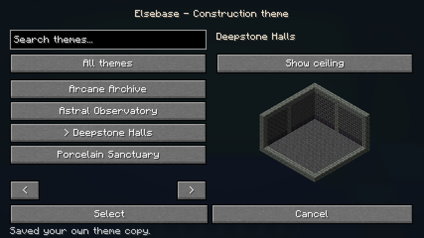
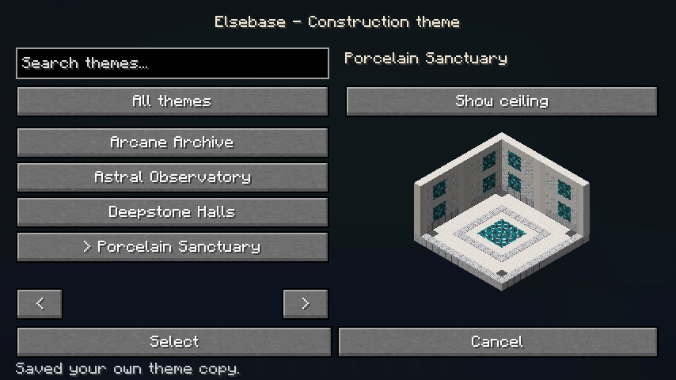
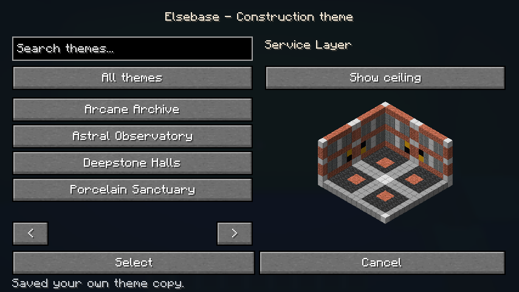

# Elsebase: aktuelle Themes im Spiel

Alle sieben freigegebenen Themes sind als vollständige Blockmuster umgesetzt. Die Bilder stammen aus dem automatisierten Minecraft-Clienttest, ohne Shader. Sie zeigen echte Vanilla-Modelle in der Menüvorschau, keine KI-Studien. Böden und Decken sind einschließlich gerichteter Blockzustände bei 90°-Drehung symmetrisch.

## Quiet Workshop

[Ansicht mit Decke](concepts/implemented-themes/theme-quiet_workshop-ceiling.png)

## Arcane Archive

[Ansicht mit Decke](concepts/implemented-themes/theme-arcane_archive-ceiling.png)

## Verdant Cloister

[Ansicht mit Decke](concepts/implemented-themes/theme-verdant_cloister-ceiling.png)

## Astral Observatory

[Ansicht mit Decke](concepts/implemented-themes/theme-astral_observatory-ceiling.png)

## Deepstone Halls

[Ansicht mit Decke](concepts/implemented-themes/theme-deepstone_halls-ceiling.png)

## Porcelain Sanctuary

[Ansicht mit Decke](concepts/implemented-themes/theme-porcelain_sanctuary-ceiling.png)

## Service Layer

[Ansicht mit Decke](concepts/implemented-themes/theme-service_layer-ceiling.png)
