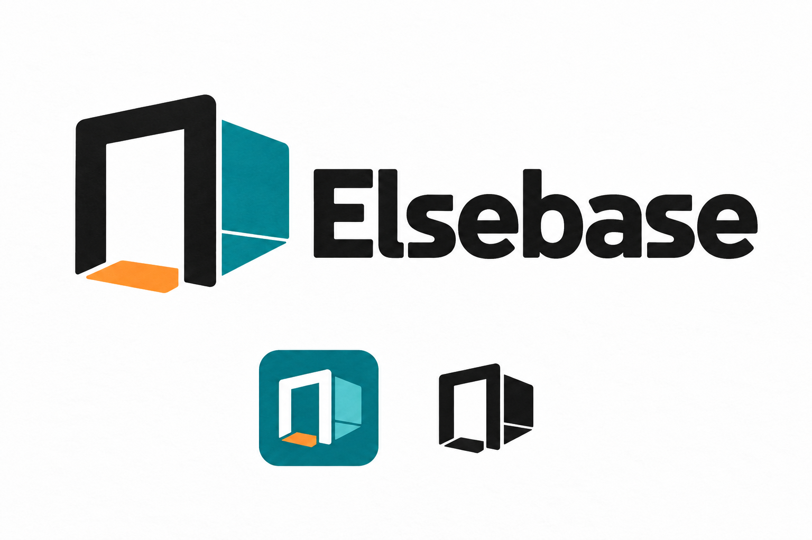
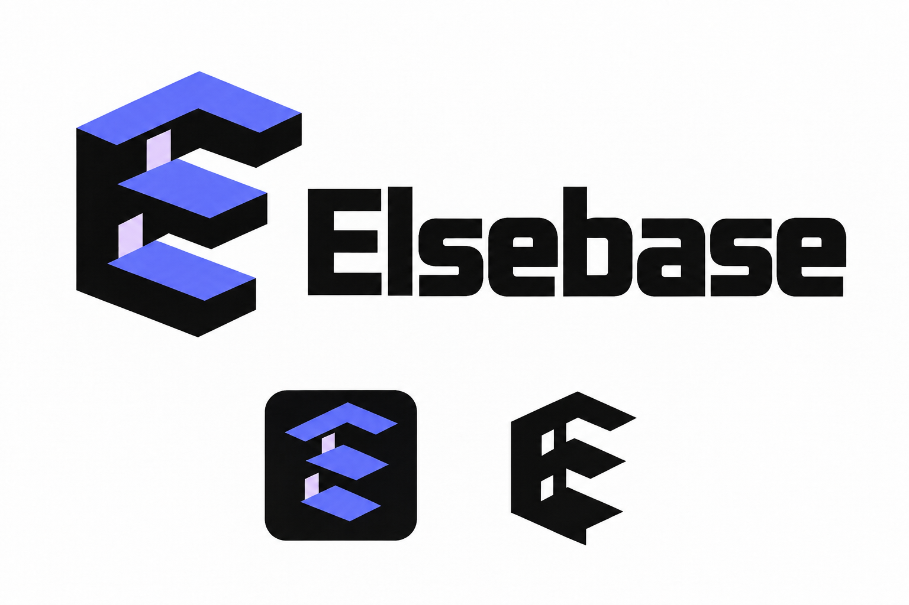
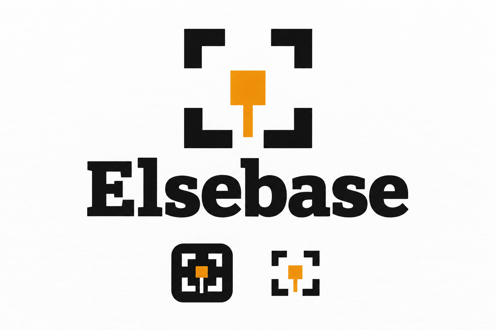

# Elsebase logo proposals

Status: on 2026-09-20 the user selected **candidate 1, The doorway beyond (Die Tür ins Anderswo)**, for Elsebase. Its doorway, offset teal room and orange threshold are the reference for further refinement. These AI-generated raster studies are not final vector masters or installed mod icons. Candidates 2 and 3 remain historical alternatives.

## Shared brief

Express a permanent building space reached through a movable entrance. Keep technology, magic and the optional dark variant equally possible. The user's “El-space” sound association supports a spatial interpretation without changing the spelling **Elsebase**. Do not imply a private protected dimension, a moving factory or always-loaded machinery.

Use a clear symbol plus the name, and a symbol-only application for small mod-list icons. Colors are proposals, not a chosen palette. All three should eventually support one-color use; the seven room styles do not require seven different logos. Only the name appears in the image, keeping the decision focused on the mark.

Applied skills: `build-brand-identity` for visual meaning and comparison, `imagegen` for the actual raster proposals. The previously checked marketing runtime is not initialized in this software project; these remain reversible documented design drafts under the user's repository workflow, with no marketing status activation or release claim.

## 1. The doorway beyond

**German label:** Die Tür ins Anderswo.

A doorway and an offset room corner explain the central interaction. Teal and a warm threshold accent make it approachable without requiring technical or magical decoration.

**Strength:** strongest immediate connection to what the mod does. **Trade-off:** door symbols are common in this category; the offset interior must supply its individual character.

## 2. The spatial E

**German label:** Das räumliche E.

A folded, spatial E connects the first letter of Elsebase to another layer of space. Indigo and periwinkle emphasize the dimensional idea, while bold geometry remains suitable for a small icon.

**Strength:** strongest link between the mark and the selected name. **Trade-off:** more abstract; the name and mod description must explain the doorway/base function.

## 3. The lasting place

**German label:** Der bleibende Ort.

A room-plan emblem surrounds a marked reference point with an open entrance. Warm charcoal and amber express the base that stays in place while the entrance changes.

**Strength:** emphasizes the persistent personal reference and building space. **Trade-off:** can resemble a floor plan or navigation symbol; it needs the surrounding name to establish the mod identity.

## Selection and production boundary

The selected symbol now has a standalone [platform PNG export](branding/README.md) for CurseForge and GitHub (2026-09-21). It is a 1254 x 1254 opaque RGB image; the original boards remain historical studies. An editable vector master is not included.

The user selected candidate 1 after comparing the three proposals. Preserve that direction in further refinement; assess small-icon silhouette and fit beside all seven themes. Exact production colors and typography remain to be specified.

Each board explores a principal wordmark and two symbol applications. The first two include a monochrome mark; the third retains its amber center. These are illustrative applications, not measured 32-pixel tests. After selection, refine geometry, produce a vector master, define actual icon sizes, and verify legibility on light and dark backgrounds. Raster lettering does not establish a font license or editable typography. No animation or gameplay code is included.

## Visual review

The initial generated files unexpectedly contained transparency and halos, making their dark lettering difficult to read in chat. A targeted ImageGen edit preserved each concept and restored a light opaque presentation with dark lettering. The three revised boards above are the delivered proposals; all spell Elsebase correctly and show distinct silhouettes. Slight paper/ink texture remains, so these are still raster studies rather than flat production masters.

The initial assistant recommendation favored the spatial E for its name association and layered-space silhouette; the user's subsequent choice of the doorway supersedes that recommendation. The selected doorway communicates the interaction most directly. The reference-point emblem remains closer to navigation or targeting imagery despite the original brief, so it is less distinctive as the main brand.

The built-in ImageGen prompts, source paths and copied-file hashes are recorded in [the generation manifest](concepts/elsebase-logo-generation.json). All three images are also emitted as native chat attachments for remote viewing.
