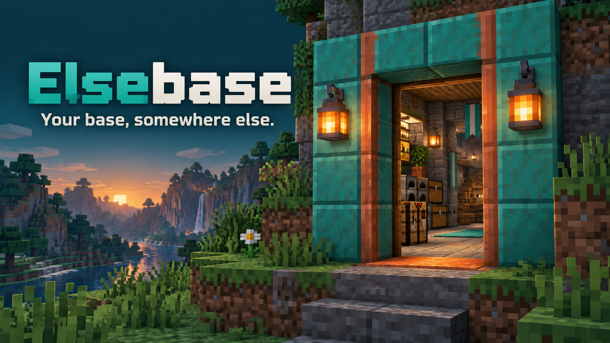
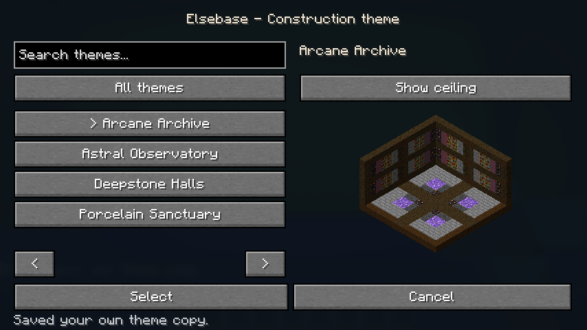

# Elsebase

## Deine Basis. Irgendwo anders.

*Illustratives Werbemotiv. Die tatsächliche Optik zeigen die Spielaufnahmen weiter unten.*

Noch eine Werkstatt. Endlich ein ordentliches Lager. Platz für das Bauprojekt, das dir schon lange im Kopf herumgeht.

**Elsebase gibt dir einen dauerhaften Ort zum Bauen, erreichbar durch eine Tür, die du selbst herbeirufst.** Drücke **F**, betrete die Backdoor-Dimension und richte dich ein. Dein persönliches Portal steht dir vom Spielstart an zur Verfügung.

Danach geht es wieder hinaus auf Entdeckungstour. Deine Basis bleibt dort, wo du sie gebaut hast, und wartet auf deinen nächsten Besuch.

## Fang mit einem Raum an

Verbinde benachbarte Räume zu einer größeren Werkstatt, baue eine Treppe ins nächste Stockwerk oder richte dir einen Keller ein. Auf sechzehn übereinanderliegenden Raumebenen kannst du deine Ideen auch in die Höhe wachsen lassen.

Mit **Construction Tool** und **Removal Tool** bearbeitest du Wände, Böden und Decken. Schau auf eine Fläche: Die Markierung zeigt dir vor dem Klick, was sich ändern wird. Benachbarte Räume besitzen eigene Wandhälften und lassen sich einzeln gestalten.

Für die erzeugten Strukturblöcke brauchst du kein Baumaterial; beim Entfernen geben sie keine Ressourcen zurück. Die Raumstruktur widersteht Explosionen. Deine selbst platzierten Blöcke und Geräte folgen weiterhin ihren normalen Regeln.

## Dein Raum, dein Stil

Wähle ein vollständiges Theme für Wände, Boden und Decke. Sieben mitgelieferte Designs reichen von **Quiet Workshop** und **Deepstone Halls** über **Arcane Archive** bis zu **Verdant Cloister**, **Astral Observatory**, **Porcelain Sanctuary** und **Service Layer**.

*Echte Menüvorschau im Spiel, ohne Shader.*

Mit dem **Paint Tool** gestaltest du einzelne Flächen um oder legst den Standard für deinen Bereich fest. Für einen eigenen Look baust du ein Muster aus geeigneten Vollblöcken und erfasst es mit dem **Scan Tool**. Speichere dein Design, exportiere es zum Teilen oder nimm es in dein nächstes Modpack mit.

Vorlagen übernehmen die Optik der Blöcke, einschließlich unterstützter Seitentexturen und Ausrichtungen. Maschinenfunktionen und Ressourcen werden dabei nicht kopiert. Im Multiplayer prüft der Server die importierten Vorlagen; alle Spieler sehen dieselbe Gestaltung.

*Deepstone Halls in der Theme-Auswahl.*

## Ein vertrauter Ort zum Zurückkommen

Mit **F** rufst du deinen Eingang herbei. Versetzt du das Portal innerhalb der Dimension, bleibt dein Rückweg draußen an der ursprünglichen Eintrittsstelle. Ein verschiebbarer **Spawn Anchor** bestimmt deinen Ankunftspunkt und hält seinen Chunk geladen, solange du online bist.

Für dauerhafte Verbindungen kannst du feste Portalpaare herstellen. Dein temporäres Portalpaar verschwindet nach einer Minute ohne Benutzung, solange du dich außerhalb befindest. So bleiben unterwegs keine alten Eingänge stehen.

Die optionale Portalvorschau zeigt dir einen begrenzten Blick auf die Blöcke am Ziel. Bei einem aktiven Iris-Shaderpack erscheint stattdessen eine animierte Portalfläche. Kreaturen und spezielle Darstellungen von Block-Entities sind nicht Teil der Live-Vorschau.

## Passend zu deiner Spielwelt

Die Dimension ist standardmäßig hell. Wenn du es unheimlicher magst, kannst du Dunkelheit und natürliches Mob-Spawning unabhängig voneinander einschalten. Weitere Einstellungen für Server und Modpacks steuern unter anderem Portalvorschau, Chunk-Laden und Vorlagenimporte.

Jeder Spieler erhält einen weit entfernten Startbereich in derselben Dimension. **Elsebase beansprucht oder schützt kein Gebiet:** Auf Servern übernehmen Claim-Mods den Bauschutz. Der Spawn Anchor lädt seinen eigenen Chunk, nicht automatisch deine gesamte Basis.

## Was wird dein erster Raum?

Installiere **Elsebase für Minecraft 1.21.1 mit NeoForge**, prüfe die Belegung von **F** und tritt ein. Vielleicht wird es erst einmal die Werkstatt, die dir bisher gefehlt hat.

**Voraussetzungen:** Minecraft **1.21.1**, NeoForge **21.1.250 oder neuer innerhalb 21.1**, Java **21**. Auf Client und Server installieren; keine weitere Gameplay-Mod erforderlich.

**Bedienung:** F ruft dein Portal herbei. Rechtsklick benutzt das Werkzeug; Shift-Rechtsklick öffnet das Menü von Construction, Paint und Scan. Da Minecraft F auch für den Handwechsel verwendet, ändere eine der beiden Belegungen. Einstellungen findest du unter **Mods → Elsebase → Config**.
