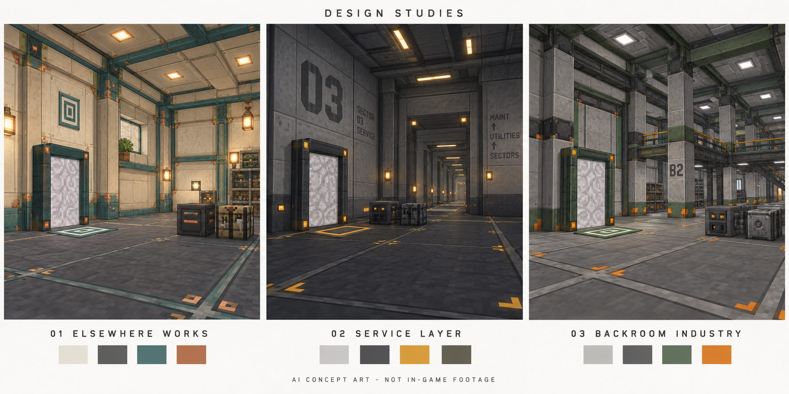

# Name, story and visual directions

Status: exploratory candidates for discussion, 2026-09-19. No name, story or visual route has been selected. No public release, final logo, texture pack or implemented gameplay is implied.

Naming update, 2026-09-20: the recommendation below is historical. An existing Minecraft mod named Elsewhere was found, and Hingespace was rejected. The user has now selected **Elsebase** and requested three logo proposals; see [the naming record](naming-and-logo.md). The visual concepts remain useful independently of their old name labels.

Scope update, 2026-09-19: the user wants selectable styles suitable for magic and other non-technical packs too. These industrial candidates remain historical options; their lore is not mandatory core lore. See [themes and configuration](themes-and-configuration.md) for seven broader style directions and a proposed theme-neutral umbrella concept.

## Brief and method

Source truth: the user's description, original design and [current portal requirements](start-points-and-portals.md). Players can explore while keeping a permanent factory; access is available immediately; the room grid can be reshaped; the personal floor anchor controls the reference point. Calm industrial atmosphere is in the original brief, while the exact palette and lore remain open.

Applied methods from `develop-brand-strategy` and `build-brand-identity`: connect promise to the actual product concept, compare materially different narratives, show recurring visual/verbal codes and their trade-offs, and keep human selection distinct from a recommendation. Naming here is an additional creative brainstorm, not trademark clearance.

The skill runtime's read-only inspection found no `.marketing-os/client.json`. This is a software project, not an initialized marketing-client workspace. Accordingly these are reversible project discussion drafts under the user's requested documentation workflow; no marketing workspace was adopted and no strategy/identity baseline or approval status was created.

The shared concept is **a permanent place to build, reachable from a changing journey**. This is the intended product benefit, not a claim that the current bootstrap already delivers it. Avoid “zero lag”, “fully seamless”, “private dimension”, “unlimited performance”, automatic machine transport and never-unloading factories.

## Candidate A — Elsewhere Works

**Emphasis:** belonging and continuity. A welcoming workshop outside ordinary geography.

**Story sketch:** Every world has places that were left out of its map. Long before anyone arrived, someone fitted one of those places with floors, lights and more rooms than they could ever use. Your first doorway finds an empty address. Nobody demands rent, a mission or an explanation. Lay your mark on the floor and that address becomes yours. Outside, your journey keeps changing. Inside, the work is where you left it.

The builders' identity can remain unanswered. Lore appears in small signage and tool descriptions rather than obligatory quests. “Yours” describes a personal reference address, not automatic protection from other players.

**German illustrative line:** „Deine Werkstatt bleibt. Du ziehst weiter.“

**Visual codes:** warm ivory wall panels, slate flooring, desaturated teal frame edges and restrained copper fasteners. Nested right-angle/square markings repeat on the floor anchor, tool and portal frame. Warm built-in lighting makes the dimension habitable without visual clutter.

**Language:** brief, reassuring and practical. Example UI tone: „Anker gesetzt.“ / „Hier ist kein Platz für den Eingang.“ Story text can be gently curious; error messages stay literal.

**Three applications:** an open-corner square tool icon; matching thin anchor floor mark and doorway corners; a mod-list illustration contrasting a changing exterior with the same waiting workshop.

**Strength:** connects the portal/anchor behavior to a memorable emotional idea and supports prolonged factory building. **Trade-off:** “Elsewhere” is broad and the industrial function needs a descriptive subtitle, e.g. “Industrial rooms beyond the world.” Name searchability and availability need a dedicated check after shortlisting.

## Candidate B — Service Layer

**Emphasis:** discovery and quiet technical mystery. The dimension is the world's hidden maintenance infrastructure.

**Story sketch:** The world you explore has a front side. Behind it runs a service layer: numbered halls, inspection marks and unfinished utility bays. The system recognizes every traveler as a different operator and assigns an unused access point. The anchor tool changes your service address. Nobody has to solve why the facility exists to put it to work.

The fictional system can explain UUID assignment and instant access without adding NPCs, a simulation plot twist or horror enemies. It is an atmospheric interpretation, not an assertion about Minecraft's actual world-generation internals.

**German illustrative line:** „Hinter der Welt ist Platz.“

**Visual codes:** cool mineral grey, charcoal panels, amber guidance marks, large sector numbers and repeated inspection squares. Long sight lines and utilitarian wall openings make the place feel infrastructural.

**Language:** restrained service labels, occasional dry understatement. Example: „Zugang zugewiesen.“ / „Arbeitsbereich verfügbar.“ Do not turn every player action into a technical error code.

**Three applications:** a compact access-stamp icon; stencil-like anchor and portal labels; sector signage integrated into room walls rather than an on-screen debug grid.

**Strength:** strongest foundation for environmental storytelling and room-to-room atmosphere. **Trade-off:** more austere, English technical terminology is less inviting, and excessive dark lighting would harm daily factory use. The broad software phrase also has weak search specificity.

## Candidate C — Backroom Industry

**Emphasis:** useful industrial space with light worldbuilding. Retain the existing working title.

**Story sketch:** An industrial expansion project discovered how to attach workshops to places rather than transport the machinery between them. The project left a repeating shell of serviced halls. The original operators are gone, but their address tools still work. You inherit the space and make its layout your own.

No corporate quest line, transport network or abandoned machinery loot is required by this story. Those would be separate gameplay choices.

**German illustrative line:** „Deine Fabrik. Gleich nebenan.“

**Visual codes:** light concrete, graphite steel, muted green frames, a few orange safety corners, strong horizontal seams and rectangular structural bays. Room organization is immediately readable.

**Language:** direct workshop terminology: anchor, threshold, partition, ceiling panel. Product description can explain what the mod does quickly.

**Three applications:** sturdy doorway silhouette as a small mod icon; green/orange coding repeated on frame and tool; neutral rooms that visually accept machines from unrelated technology mods.

**Strength:** closest to the supplied design and easiest to explain as an infrastructure mod. **Trade-off:** “Backroom” can suggest horror despite the intended calm experience; “Industry” can suggest a machine/processing mod rather than a dimension utility.

## Recommendation for discussion

Explore **A, Elsewhere Works**, first if the desired feeling is “my reliable workshop wherever I go.” Choose **B, Service Layer**, if the unknown purpose of the rooms should dominate the atmosphere. **C** is the strongest continuity option if the existing industrial premise is already the right tone.

This is a creative-fit recommendation, not validated audience research or a final market-positioning decision. All three can use the same gameplay. Do not combine their codes by default; choose a direction or deliberately define a new hybrid.

The preliminary name search on 2026-09-19 was only a quick collision screen. No exact Minecraft-mod result surfaced for the queried “Elsewhere Works”; absence from these search results does not establish availability. Shorter alternatives were deprioritized because their names already have visible unrelated uses: [ELSEWORKS](https://www.elseworks.org/), [Foldworks](https://www.foldworks.net/) and [BetweenWorks](https://betweenworks.co/). No trademark or platform-handle clearance has been performed.

## Visual study



Generated with the built-in ImageGen tool. This is **AI concept art, not in-game footage**. The image communicates material, lighting, frame and anchor direction; it is not a dimensioned room plan or a texture-ready asset. The thin floor markings illustrate the non-colliding anchor. Portal surfaces are static placeholders.

Visual inspection: all three captions are readable and correctly matched; palettes and atmosphere differ; the artifact includes its concept-art disclosure. The right panel adds gallery-like upper structures, and the left panel includes decorative details: these are illustrative, not approved generated structures. The textures/lighting are richer than a final vanilla-style texture implementation may use. Exact block counts, anchor collision, game performance and accessibility are not validated by the picture. The middle route needs a brightness check before actual game production.

File: `docs/concepts/design-studies.png`. SHA-256: `4C4F0143953439ED8057BFC9172049E9D28F44268E0A48D8E114815D5A8ACB1A`.

### Generation prompt

```text
Use case: stylized-concept. Create ONE landscape comparison concept board with three equally sized side-by-side panels for a proposed Minecraft Java industrial dimension mod. This is exploratory art, NOT screenshots of an implemented mod. Top small heading: 'DESIGN STUDIES'. Each panel depicts the SAME functional brief: a spacious modular voxel industrial room with square chunk-aligned floor panel boundaries, removable paneled walls and high paneled ceiling, one modest rectangular pedestrian portal frame with a STATIC opaque subtly patterned surface (no live view), one paper-thin carpet-like anchor marking flush on the floor near the portal, one or two simple cubic machine placeholders. Calm, practical, inhabitable, atmospheric, no horror. Minecraft-compatible blocky geometry and low resolution pixel-art surface textures, avoid photorealism, smooth furniture and complex geometry. Strong readable architectural differences and clear floor space. LEFT caption '01 ELSEWHERE WORKS': welcoming personal workshop outside ordinary geography, warm ivory panels, slate floor, desaturated teal trims, small copper details, warm integrated light, simple nested square corner markers. MIDDLE caption '02 SERVICE LAYER': hidden maintenance infrastructure behind the world's surface, cool grey service panels, dark graphite floor, restrained amber direction markings, large stenciled sector numbers, symmetrical utilitarian long doorways receding into modular service halls, quiet and mysterious without menace. RIGHT caption '03 BACKROOM INDUSTRY': robust configurable industrial factory shell, light grey concrete and graphite steel panels, desaturated green frame accents, sparing orange safety corners, repeating gantry-like square structural bays and inset ceiling lights. All three pleasant and bright enough for practical factory work. Each panel has the exact caption beneath, and a small strip of 4 color swatches. White/off-white board margins, clear vertical gutters, uncluttered editorial layout. Bottom footer exact: 'AI CONCEPT ART - NOT IN-GAME FOOTAGE'. No people, mobs, logos, guns, creepy objects, cables through portal, impossible curved shapes, neon vortex, readable marketing promises, or portrayal of live portal preview. Purpose: compare visual/lore directions before user selection; do not present any as final.
```
