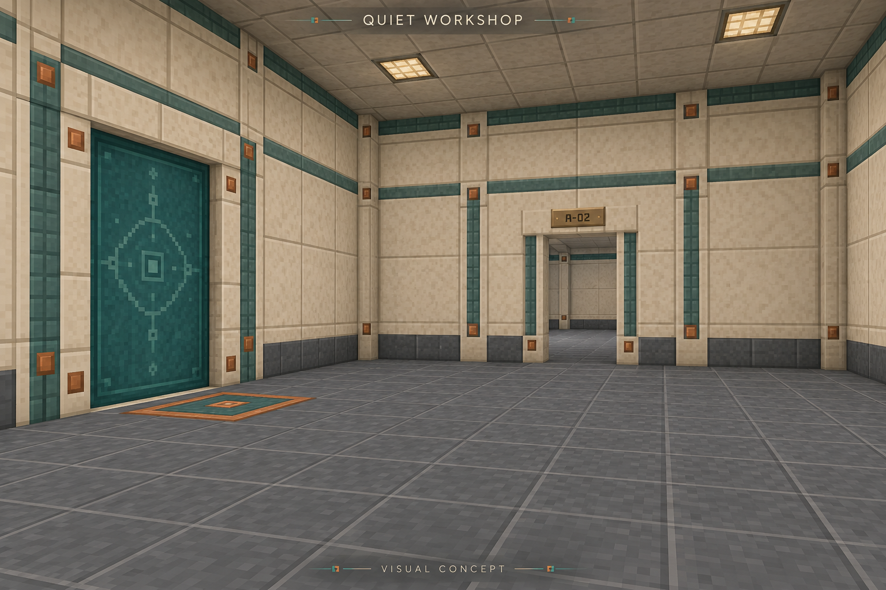
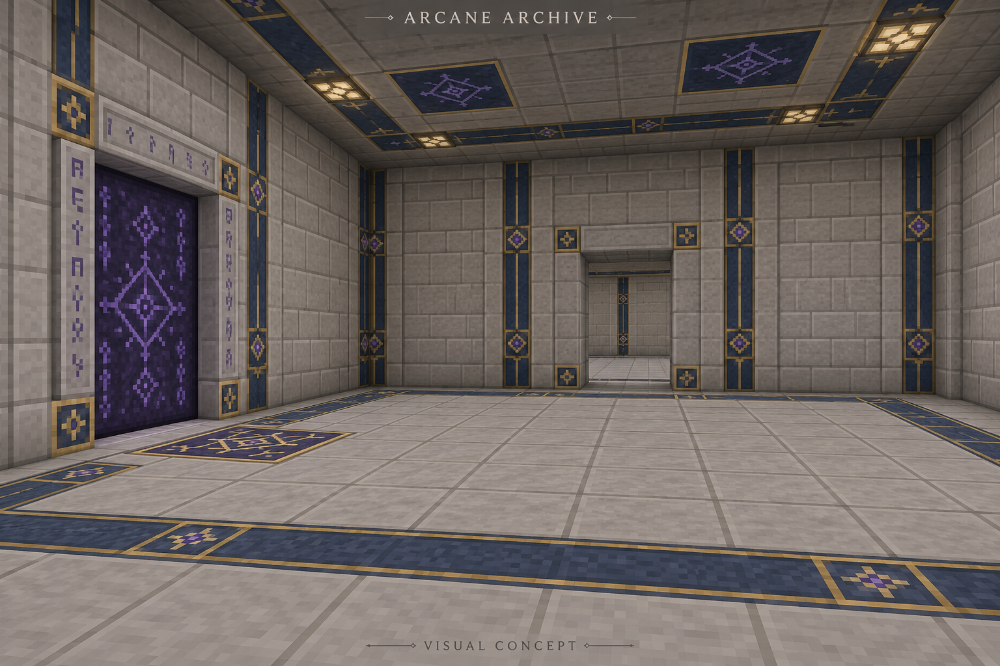
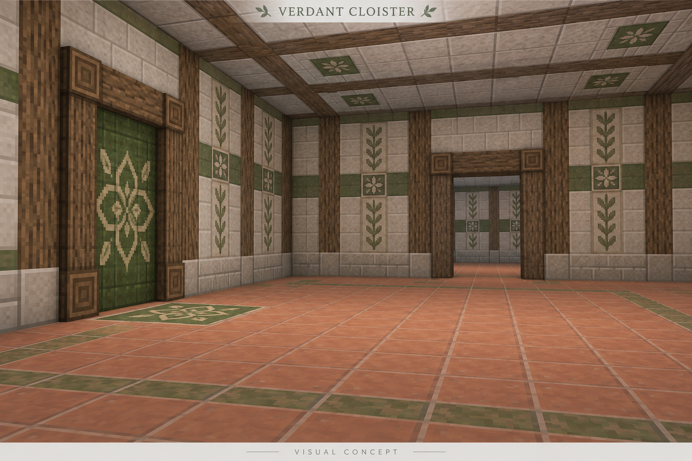
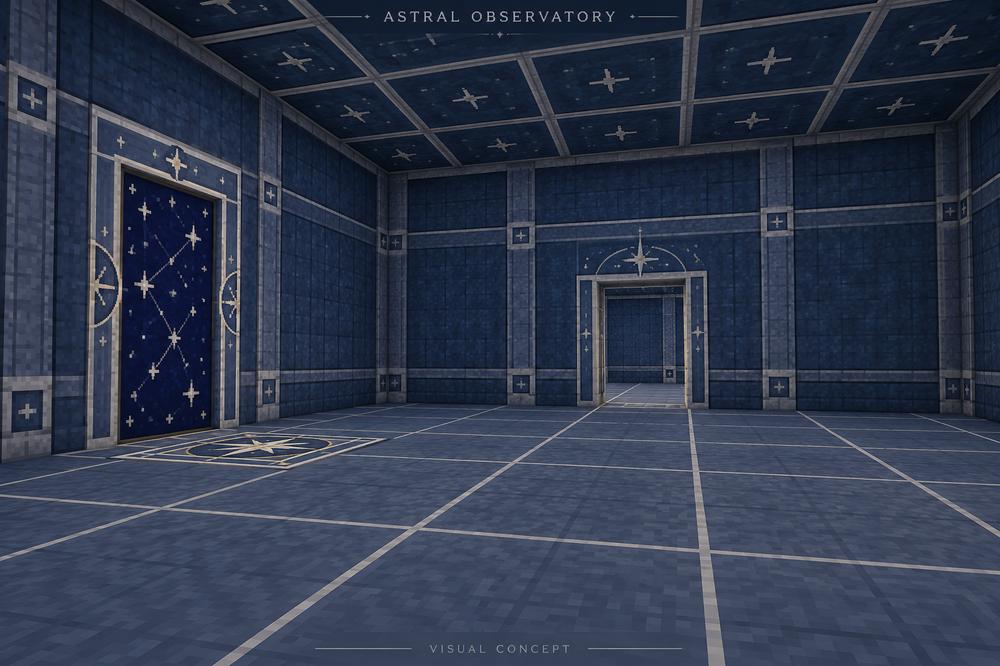
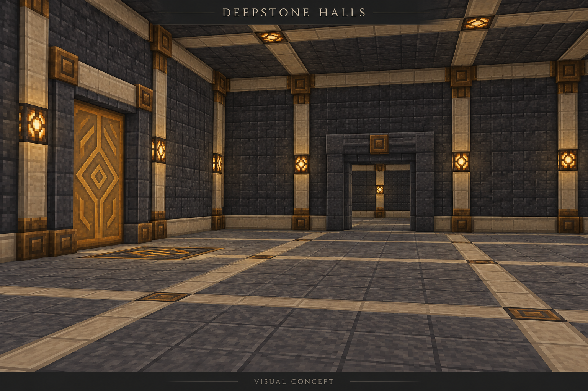
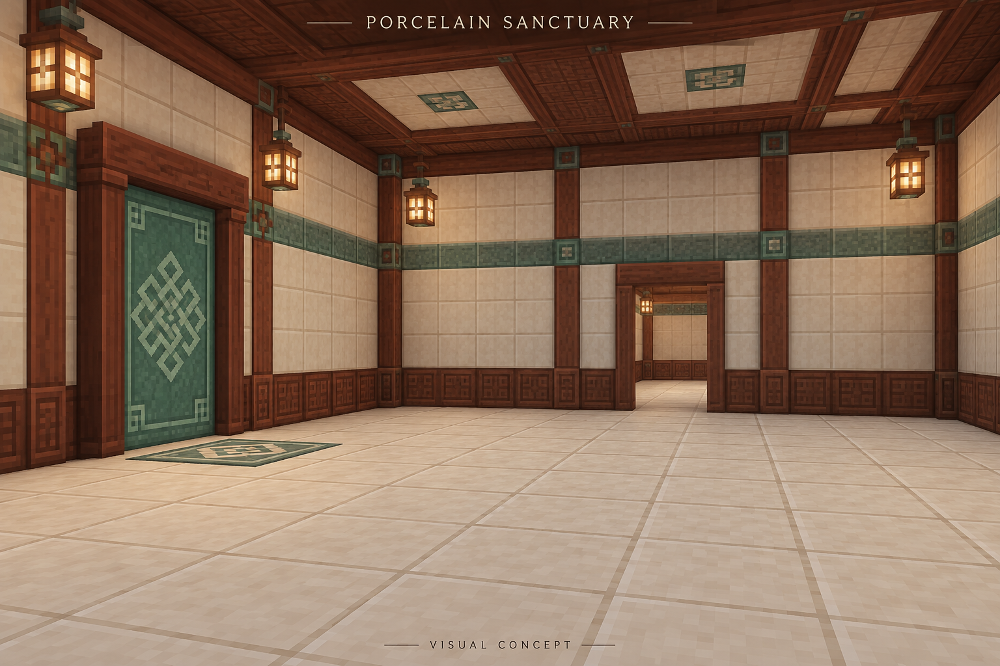
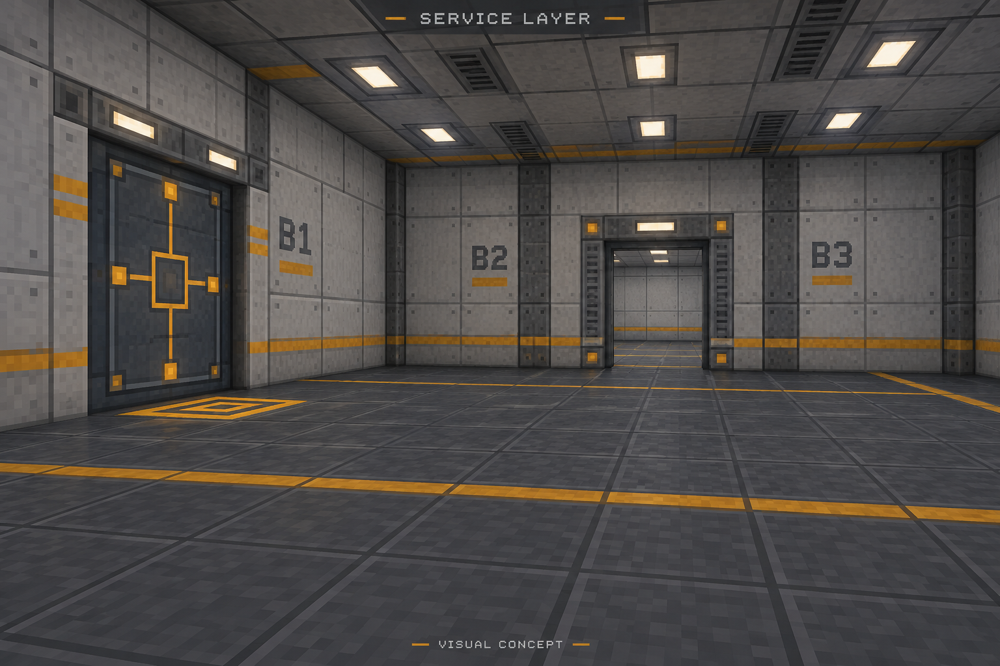

# Visual theme studies

Created 2026-09-19 with the built-in ImageGen tool. These seven AI-generated architectural studies illustrate the [requested themes](themes-and-configuration.md); they are not in-game screenshots, production textures or exact block layouts. On 2026-09-20 the user accepted all seven visual directions and requested inclusion of all of them where feasible. One style per modpack is the accepted scope; the default style is undecided. Gameplay implementation still awaits explicit approval.

The brief keeps a similar room composition, an opaque static portal surface and a carpet-thin floor anchor across the candidates. Image generation may vary dimensions and detail; portal size, room height, structural boundaries, lighting and final texture resolution still need implementation decisions. The images do not demonstrate rendering performance or collision behavior.

## Quiet Workshop

Warm ivory, slate, muted teal and copper: an understated workshop for technology or mixed packs.

## Arcane Archive

Pale stone, blue inlays and violet seals: a scholarly magical annex.

## Verdant Cloister

Pale stone, timber, terracotta and leaf motifs: a sheltered workspace for nature magic and farming.

## Astral Observatory

Deep blue, silver and constellation markings: an enclosed workshop with an astronomical identity.

## Deepstone Halls

Basalt, sandstone and bronze: a sturdy guildhall for mining and medieval packs.

## Porcelain Sanctuary

Cream tile, red-brown wood and jade: a quiet fantasy guesthouse and workroom.

## Service Layer

Concrete, graphite and amber guidance: the world's hidden maintenance infrastructure.

## Production record

The complete prompts and source paths are recorded in [the generation manifest](concepts/theme-generation.json). Each image was generated independently from text, with no reference image. Workspace copies preserve the original output without editing it. Native image attachments were also emitted in the conversation so the user can inspect them remotely without relying on local filesystem links.

Visual review: all seven outputs show a recognizable static portal, a flat anchor, clear workspace and a distinct material palette. Porcelain Sanctuary introduces projecting lantern models; these remain illustrative and would need a compatible baked model or an inset-light substitution. Astral Observatory is appreciably darker than the other routes; final gameplay lighting must be evaluated separately. Decorative curves are surface motifs, not a promise of curved structural geometry. Original and copied image hashes were compared successfully.
