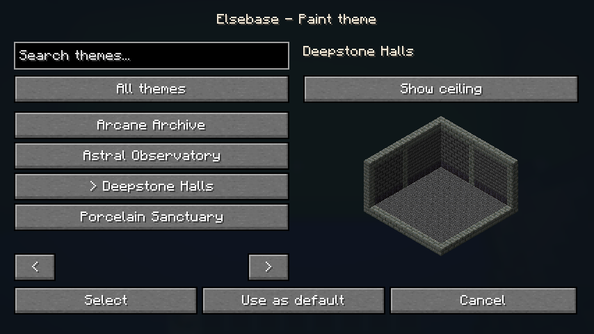
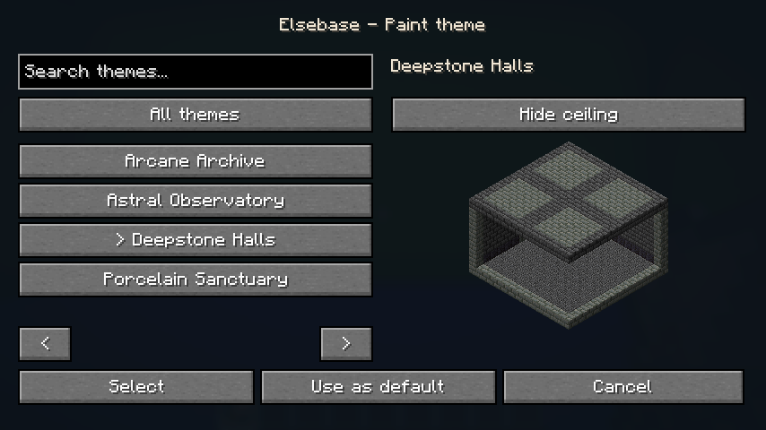
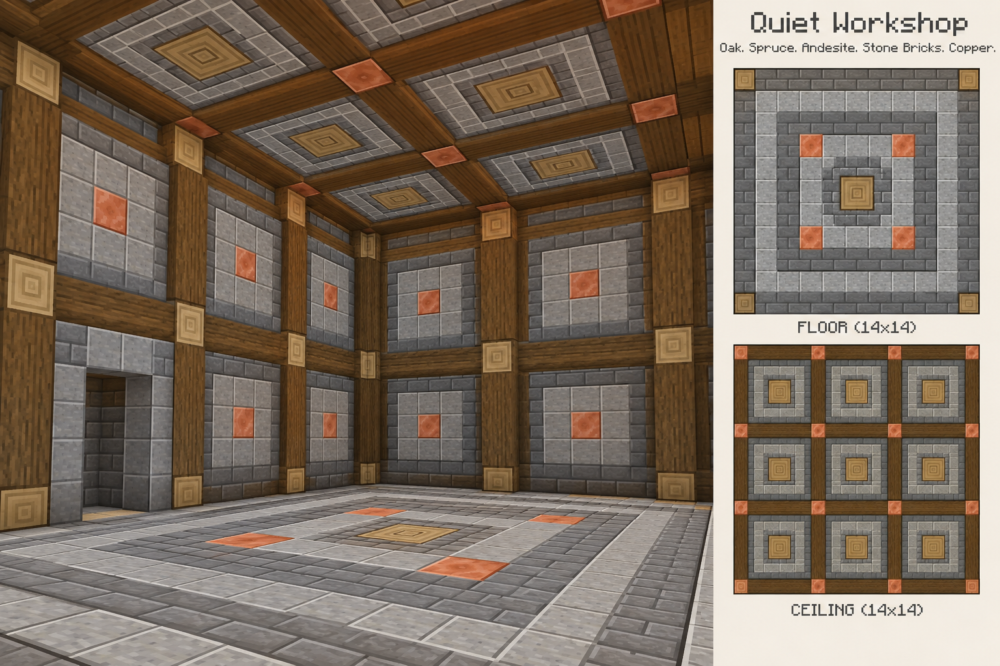
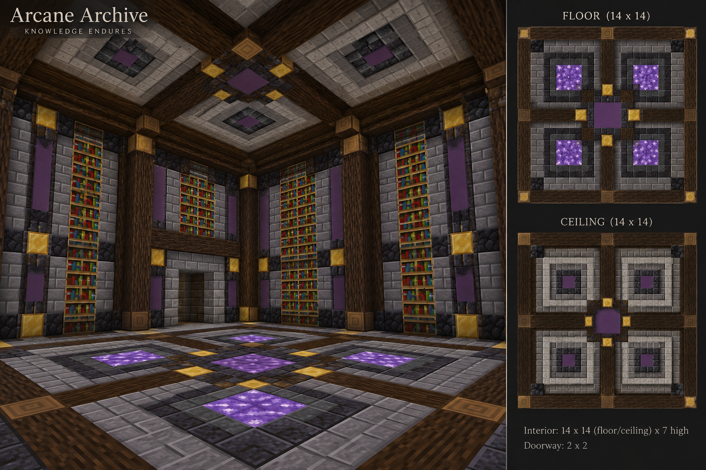
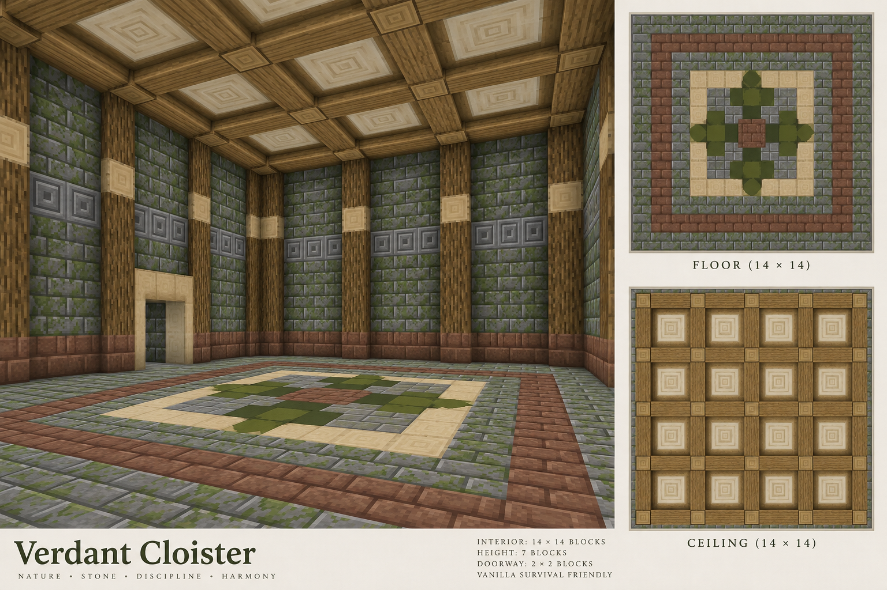
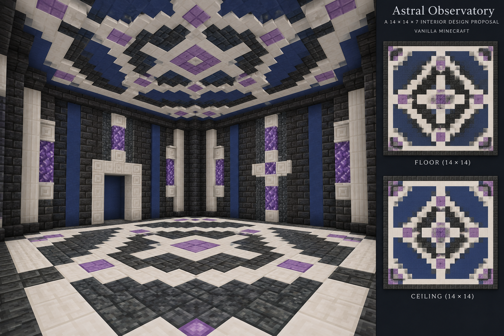
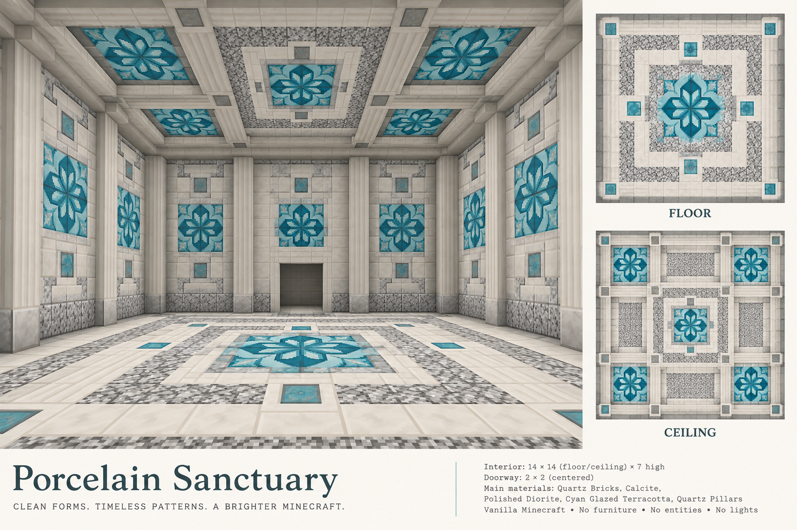
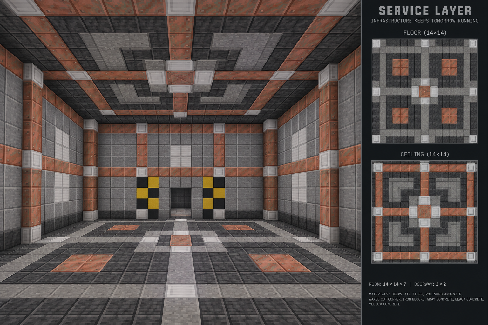

# Überarbeitete Theme-Vorschläge

Die [aktuelle Galerie mit echten Spielaufnahmen](current-theme-gallery.md) zeigt die umgesetzten Blockmuster.

Deepstone Halls ist freigegeben und als Tiefenschiefer-/Tuff-Muster umgesetzt. Auch diese sechs weiteren Richtungen wurden freigegeben und als echte Blockmuster umgesetzt.

Mehr Holzstruktur, Materialkontrast, Keramik und klar erkennbare Muster lösen die vorherigen großen Leerflächen ab. Böden und Decken erhalten jeweils eine bei 90°-Drehung gleiche Anordnung; die Draufsichten rechts zeigen die beabsichtigten Muster. Diese KI-Designstudien sind keine exakten Minecraft-Baupläne: Blockzahlen, Texturdetails und Diagramme können abweichen. Die Umsetzung verwendet echte Vanilla-Modelle; vollständige Muster samt gerichteter Materialien werden auf Symmetrie geprüft. Die technische Raumgeometrie bleibt unverändert und bündig.

## Deepstone Halls: bereits umgesetzt

Echte Client-Aufnahmen des freigegebenen Musters, mit Vanilla-Texturen. Anders als die folgenden Designstudien zeigen sie den aktuellen Mod:

## Quiet Workshop

Holzrahmen, Stirnholz, Stein und Kupfereinlagen; symmetrische Kassetten statt einseitiger Balken.

## Arcane Archive

Dunkles Holz, Bücherregale, violette Einsätze und kleine Schwarzstein-/Goldakzente.

## Verdant Cloister

Moosige Ziegel, helles Stirnholz und ein vierfach wiederholtes grünes Bodenmotiv.

## Astral Observatory

Quarz und dunkler Stein mit geometrischen Sternmotiven und Amethystakzenten.

## Porcelain Sanctuary

Quarz, Calcit und glasierte Terrakotta als ausgerichtete Keramikmotive.

## Service Layer

Kupferbänder, Stein und Eisenflächen mit symmetrischem Leitungsraster.

## Herkunft

Erzeugt mit dem eingebauten `image_gen` und dem imagegen-Skill. [Exakte Prompts und Originalpfade](concepts/vanilla-v3/prompts.json). Die Projektkopien liegen unter `docs/concepts/vanilla-v3`; die vorherigen Vorschläge bleiben erhalten. Alle Bilder sind Designreferenzen, keine Blocktexturen.
