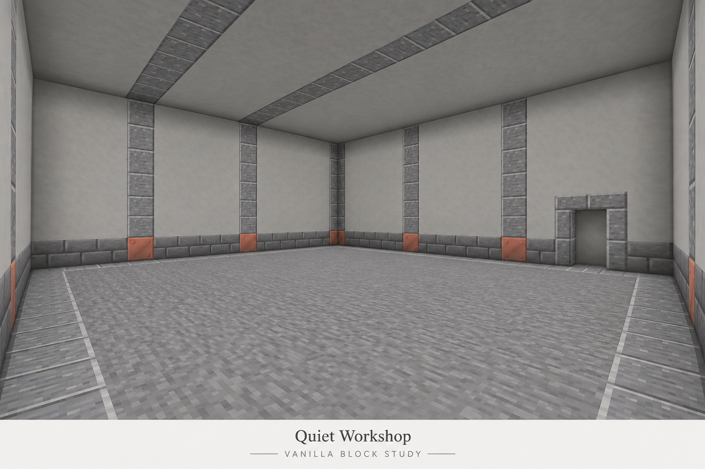
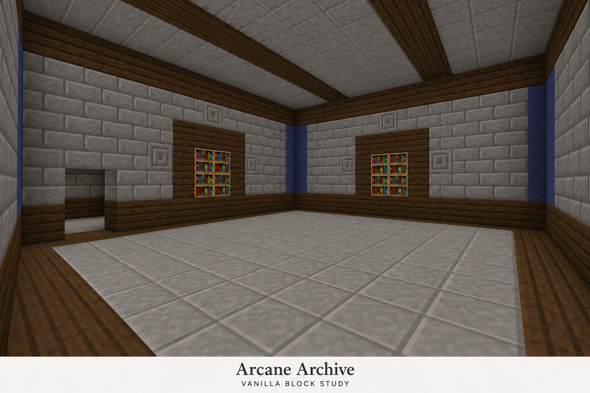
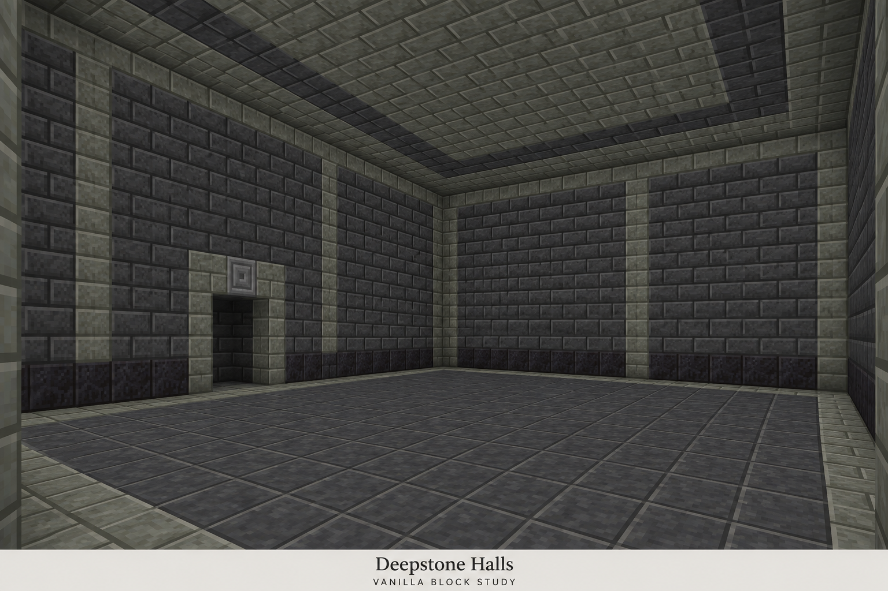
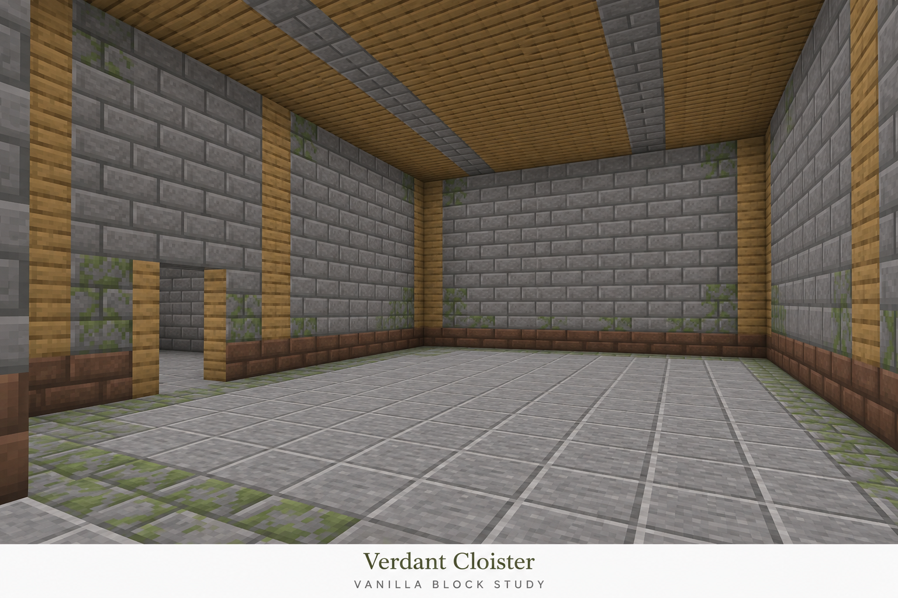
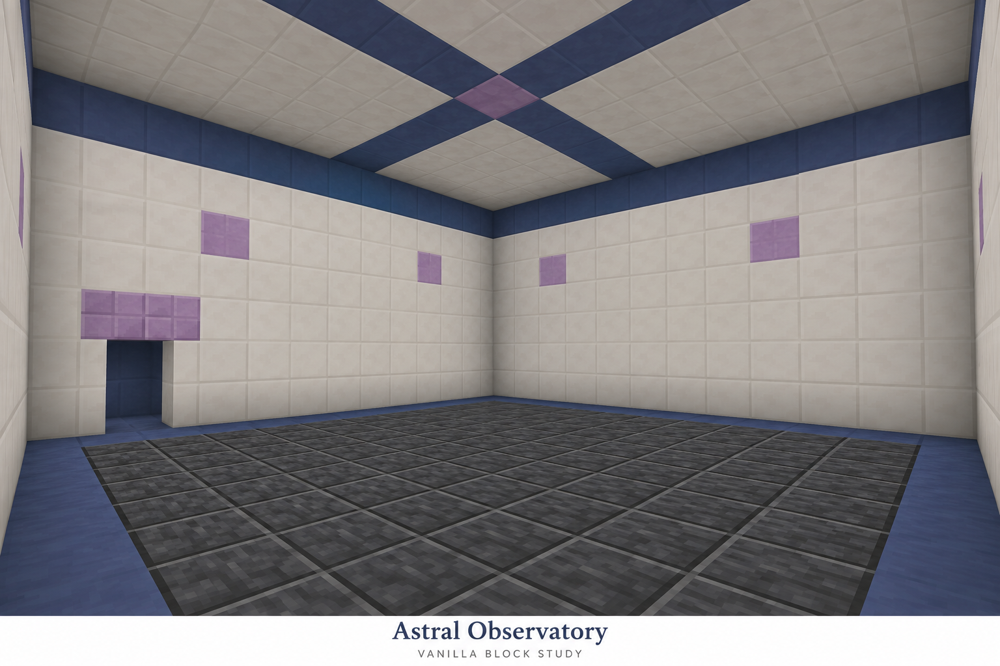
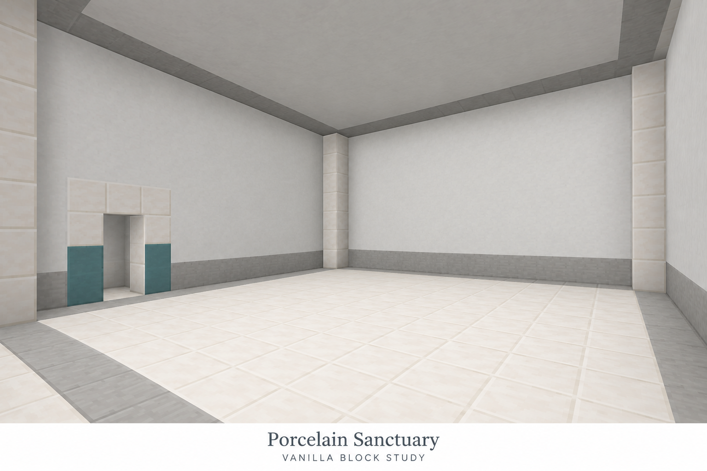
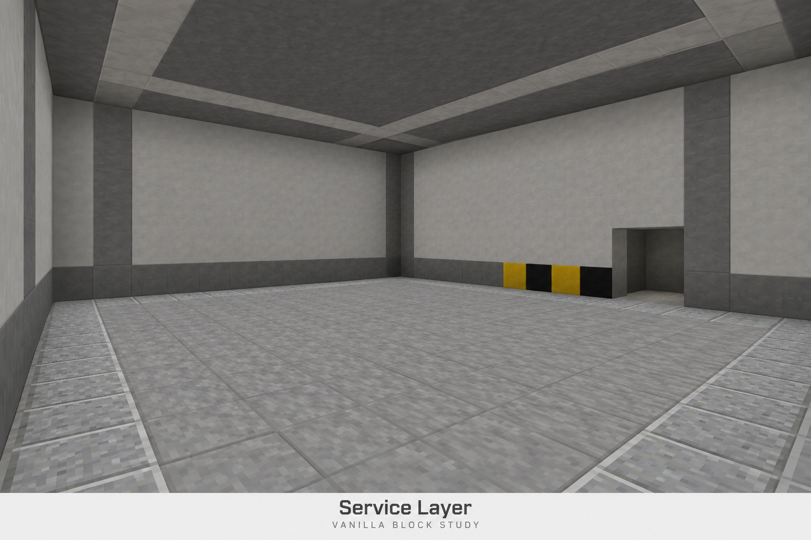

# Vanilla-Block-Themes: neue Bildvorschläge

**Aktualisierung:** Deepstone Halls wurde freigegeben und als echtes Blockmuster umgesetzt. Für die anderen sechs Themes gibt es [überarbeitete Vorschläge](vanilla-theme-proposals-v3.md). Die folgenden Bilder dokumentieren die vorherige Runde.

Die Richtung: große ruhige Flächen, nachvollziehbare Muster aus ganzen Blöcken, wenige Akzente. Jedes Theme umfasst Wand, Boden und Decke. Die Bilder sind KI-generierte Designstudien, keine Minecraft-Screenshots oder maßgenauen Baupläne. Texturen, Blockzahlen und Türmaße können im Bild abweichen; eine spätere Umsetzung verwendet echte Vanilla-Materialien und die bestehenden Raummaße mit 2×2-Durchgängen. Die Bilder werden niemals als Blocktexturen verwendet.

## 1. Quiet Workshop

Ruhige Werkstatt: Glatter Stein und hellgrauer Beton, Andesitgliederung, wenige Kupferakzente.

## 2. Arcane Archive

Magisches Archiv: Steinziegel, dunkles Eichenholz und bündige Bücherregale; dezente blaue Akzente.

## 3. Deepstone Halls

Unterirdische Hallen: Tiefenschieferziegel, polierter Tiefenschiefer und heller Tuff als Einfassung.

## 4. Verdant Cloister

Begrünter Kreuzgang: Steinziegel mit wenigen moosigen Partien, Eichenholz und Lehmziegelsockel.

## 5. Astral Observatory

Astrales Observatorium: Heller Quarz, dunkler Fliesenboden, blaue Terrakotta und einzelne Purpurakzente.

## 6. Porcelain Sanctuary

Porzellanrefugium: Weißer Beton und Quarz mit hellgrauen Einfassungen und sparsamer cyanfarbener Terrakotta.

## 7. Service Layer

Versorgungsebene: Grauer Beton, glatter Stein und Andesit; gelb-schwarze Markierung nur am Durchgang.

## Herkunft und Umsetzung

Erzeugt mit dem eingebauten `image_gen` nach dem imagegen-Skill, jeweils als eigenständiges Bild. [Exakte Prompts und Herkunft](concepts/vanilla-v2/prompts.json). Originale blieben erhalten; diese Galerie verwendet Kopien im Projekt.

Nach Freigabe werden die Richtungen als vollständige Blockmuster umgesetzt und anhand echter Ingame-Vorschauen geprüft. Besondere Blockfunktionen werden nicht übernommen: etwa Bücherregale sind nur das Erscheinungsbild ressourcenloser Strukturblöcke. Die Materialprüfung und Laufzeitgrenzen bleiben bestehen.
